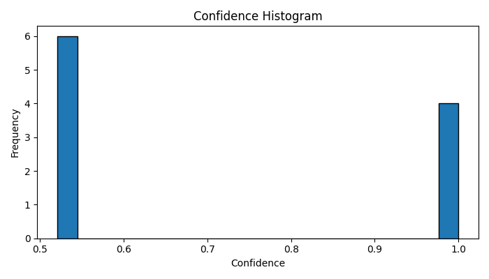
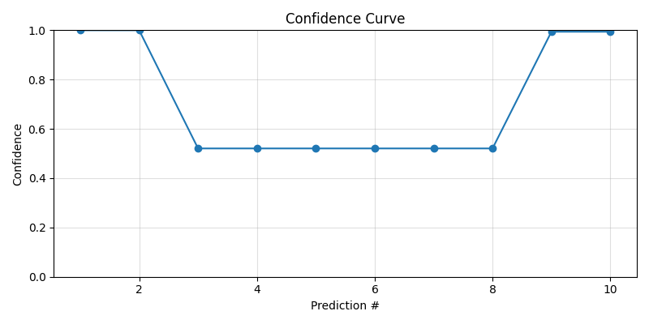
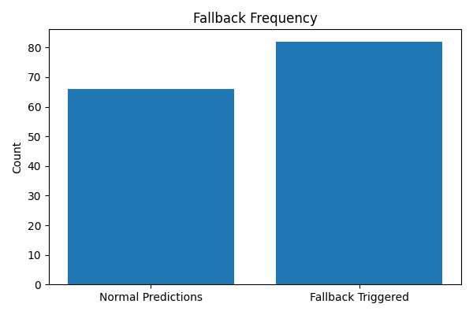

---

# **Self-Healing Text Classification System**

A production-ready sentiment classification pipeline built using a **LoRA fine-tuned DistilBERT model** and a **LangGraph-based Directed Acyclic Graph (DAG)**.
The system intelligently handles low-confidence predictions through human-in-the-loop clarification and an optional backup zero-shot classifier, ensuring correctness over blind automation.
##  Demo Video

 **Watch the full working demo here:**  
  [Click to View on Google Drive](https://drive.google.com/file/d/1OyBqnY6p5G0Gguy-jtfSHUuZX687xA8F/view?usp=sharing)
---

##  Download Model & Dataset

###  Dataset

Full dataset used for fine-tuning (raw + processed):

  [click here to see the complete dataset(row and processed)](https://drive.google.com/drive/folders/1zOKXEYsABH2yBv3cTAUfpLdVWZyRgH6V?usp=sharing)

###  Fine-Tuned Model

Complete LoRA fine-tuned DistilBERT model:

  [click here to see the complete model](https://drive.google.com/drive/folders/1O67jaaKyfTs5YrfCzzfrCwJ1S_pt97_d?usp=sharing)

---

## **Demo Output (Screenshot)**

<p align="left">
  
</p>

---

## **Why the Screenshot Output Differs from the Assignment Example**

The assignment includes a sample interaction showing low confidence and fallback.
However, in this project the fine-tuned DistilBERT model often produces **very high confidence scores (85–99%)** on IMDB due to:

* Simplicity of the dataset
* Strong adaptation during LoRA fine-tuning
* Clear sentiment clues in most reviews

As a result:

* High-confidence predictions skip fallback
* Ambiguous reviews still trigger fallback correctly

To force fallback, you can:

* Increase threshold (0.70 → 0.99), or
* Use ambiguous inputs.

---

## **Overview**

This project implements a **self-healing classification workflow** that:

* Performs sentiment classification using a fine-tuned transformer model
* Checks confidence for every prediction
* Triggers fallback when confidence is low
* Uses user clarification or a backup model
* Logs all events for analysis

The focus is on correctness, trust, and human-in-the-loop safety.

---

## **Why LangGraph**

LangGraph enables:

* Deterministic step-by-step routing
* Modular nodes for each decision stage
* Transparent debugging
* Easy extensibility

---

## **Human-in-the-Loop Rationale**

When confidence is low, the system seeks clarification from the user rather than making a blind automated decision.
If the user is unsure, the system falls back to model prediction but marks it clearly.

---

## **System Architecture**

```
User Input (CLI)
│
▼
InferenceNode (LoRA DistilBERT)
│
▼
ConfidenceCheckNode (Threshold: 70%)
├── High Confidence → FinalizeNode
└── Low Confidence  → FallbackNode → FinalizeNode
```

---

## **DAG Diagram**

<p align="left">
  
</p>

---

## **Project Structure**

```
self_healing_cls/
├── data/
├── models/
├── nodes/
│   ├── inference.py
│   ├── confidence.py
│   ├── fallback.py
│   └── finalize.py
├── graphs/
│   └── classification_dag.py
├── scripts/
│   ├── train.py
│   ├── run_cli.py
│   ├── analyze_logs.py
│   └── load_backup.py
├── utils/
│   ├── config.py
│   └── logger.py
├── logs/
├── dag_diagram.png
├── demo_output.png
├── requirements.txt
└── README.md
```

---

## **Installation**

### Create virtual environment

```
python -m venv myenv
myenv\Scripts\activate
```

### Install dependencies

```
pip install -r requirements.txt
```

---

## **Fine-Tuning the Model (LoRA)**

Dataset format:

```
text,label
"I loved this movie!",1
"It was boring.",0
```

### Train on full dataset

```
python scripts/train.py --csv data/train.csv
```

### Fast experiment

```
python scripts/train.py --csv data/train.csv --sample_size 2000
```

Model artifacts saved in:

```
models/lora_finetuned/
```

---

## **Running the Self-Healing CLI**

### Standard Mode (Human-in-the-Loop Fallback)

```
python scripts/run_cli.py --model_path models/lora_finetuned
```
### Backup Model Mode (Zero-Shot Classifier Enabled)
```
python scripts/run_cli.py --model_path models/lora_finetuned --use_backup
```


---

## **CLI Flow Examples (Based on Actual Experimental Output)**
###  High confidence

```
Input: This movie was fantastic.
[InferenceNode] Predicted: Positive | Confidence: 98%
Final Label: Positive (High-confidence model prediction)
```

###  Low confidence → user correction

```
Input: The movie was okay, not too bad but not great either

[InferenceNode] Predicted: Positive | Confidence: 66%
[ConfidenceCheckNode] Confidence too low → triggering fallback...
[FallbackNode] Could you clarify your intent? Was this a negative review?

User: yes,it was definitely negative

Final Label: Negative (Corrected via user clarification)
```

###  User uncertain

```
User: not sure
Final Label: Positive (Model prediction retained — user unsure )
```
### With backup zero-shot model

```
Input: I feel mixed about the movie, not sure how I feel.

[InferenceNode] Predicted: Negative | Confidence: 52%
[ConfidenceCheckNode] Confidence too low → triggering fallback...
[BackupModel] Prediction: Negative | Confidence: 77%

Final Label: Negative (Final label chosen via backup model)
```
---

#  **Log Analysis (WITH IMAGES + ANALYSIS)**

Generate visualizations:

```
python scripts/analyze_logs.py
```

### **Charts generated (stored in `logs/`):**

* confidence_histogram.png
* confidence_curve.png
* fallback_stats.png

---

## **Confidence Histogram**

<p align="center">
  
</p>

**Analysis:**
Most predictions fall into two groups — around **0.55** when the model is unsure, and **0.95+** when the model is highly confident. This simply shows the model is confident for clear reviews and less confident for mixed ones.

---

## **Confidence Curve**

<p align="center">
  
</p>

**Analysis:**
The confidence moves up and down depending on each input. Unclear reviews cause dips near **0.55**, while clear positive or negative reviews raise confidence close to **1.0**.

---

## **Fallback Frequency**

<p align="center">
  
</p>

**Analysis:**
Fallback happened more times than normal predictions. This means the system correctly triggered fallback whenever the confidence was low.


---

## **Chart Descriptions**

* **confidence_histogram.png:** Distribution of model confidence.
* **confidence_curve.png:** Confidences over time.
* **fallback_stats.png:** Count of fallback events vs normal predictions.

---

## **Evaluation Mapping**

| Requirement                   | Status      |
| ----------------------------- | ----------- |
| Fine-tuned transformer model  | Completed   |
| Confidence-based fallback     | Implemented |
| Human-in-the-loop interaction | Implemented |
| LangGraph DAG workflow        | Completed   |
| Interactive CLI               | Completed   |
| Structured logs               | CSV + JSONL |
| Backup model (optional)       | Implemented |
| Visualization utilities       | Implemented |
| Documentation                 | Completed   |

---

## **Author**

**Gaurav Kumar**
GitHub: [https://github.com/Gaurav9693089415](https://github.com/Gaurav9693089415)

---
