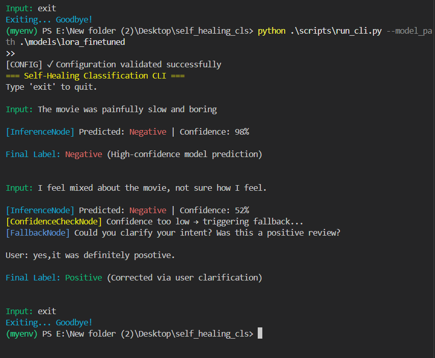
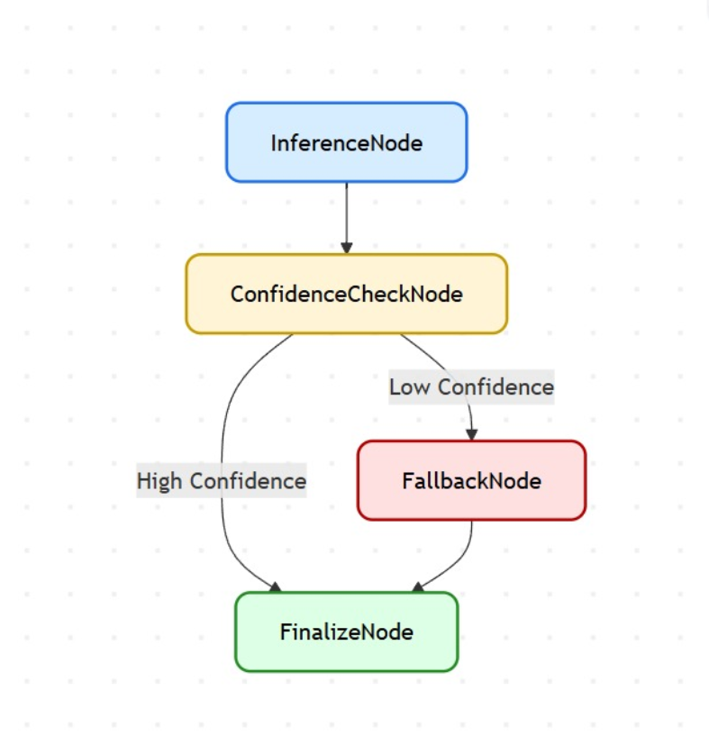

---

# **Self-Healing Text Classification System**

A production-ready sentiment classification pipeline built using a **LoRA fine-tuned DistilBERT model** and a **LangGraph-based Directed Acyclic Graph (DAG)**.
The system intelligently handles low-confidence predictions through human-in-the-loop interaction and an optional backup zero-shot classifier, ensuring correctness over blind automation.


---
##  Demo Video

 **Watch the full working demo here:**  
 [Click to View on Google Drive](https://drive.google.com/file/d/1AGlavGTjuYHzGS0AVRcapcsw_PqAO8yy/view?usp=sharing)
 
##  Demo Output (Screenshot)

Below is the actual CLI output showing real-time debate rounds and the final judge verdict.

<p align="left">
  
</p>

## **Overview**

Modern text classifiers often produce confident outputs, but when confidence is low, misclassifications become risky.
This system introduces a **self-healing architecture** that:

* Performs accurate sentiment classification using a fine-tuned transformer model
* Checks prediction confidence
* Triggers fallback when confidence is low
* Seeks user clarification or consults a backup model
* Produces a robust final decision with complete logging

This design aligns with **safety-first AI principles** and demonstrates practical human-in-the-loop decision routing.

---

## **Why LangGraph?**

LangGraph provides a structured, node-based workflow where each step is defined as an independent, testable module.
Using LangGraph ensures:

* Deterministic execution flow
* Clear routing based on confidence thresholds
* Modular design (easy to extend and maintain)
* Transparent state transitions
* Robust fallback handling

It is well-suited for classification systems requiring controlled logic, recovery paths, and traceability.

---

## **Human-in-the-Loop Rationale**

When the model is uncertain, automated decisions can be incorrect.
The system therefore prompts:

> “Was this a positive review?”

User clarification helps prevent wrong outputs and allows the classifier to maintain reliability in ambiguous cases.
If the user remains unsure, the system preserves the original prediction but clearly marks the decision as uncertain.

---

## **System Architecture**

```
User Input (CLI)
     │
     ▼
InferenceNode (LoRA DistilBERT)
     │
     ▼
ConfidenceCheckNode (Threshold: 70%)
     ├── High Confidence → FinalizeNode
     └── Low Confidence  → FallbackNode → FinalizeNode
```

---

## **DAG Diagram**

<p align="center">
  
</p>

---

## **Project Structure**

```
self_healing_cls/
├── data/
├── models/
├── nodes/
│   ├── inference.py
│   ├── confidence.py
│   ├── fallback.py
│   └── finalize.py
├── graphs/
│   └── classification_dag.py
├── scripts/
│   ├── train.py
│   ├── run_cli.py
│   ├── analyze_logs.py
│   └── load_backup.py
├── utils/
│   ├── config.py
│   └── logger.py
├── logs/
├── dag_diagram.png
├── requirements.txt
└── README.md
```

---

## **Installation**

### Create virtual environment

```
python -m venv myenv
myenv\Scripts\activate
```

### Install dependencies

```
pip install -r requirements.txt
```

---

## **Fine-Tuning the Model (LoRA)**

Dataset format:

```
text,label
"I loved this movie!",1
"It was boring.",0
```

### Train on full dataset

```
python scripts/train.py --csv data/train.csv
```

### Fast experiment (sample only)

```
python scripts/train.py --csv data/train.csv --sample_size 2000
```

Model output directory:

```
models/lora_finetuned/
```

---

## **Running the Self-Healing CLI**

### Standard mode (human fallback only)

```
python scripts/run_cli.py --model_path models/lora_finetuned
```

### With backup zero-shot model

```
python scripts/run_cli.py --model_path models/lora_finetuned --use_backup
```

---

## **CLI Flow Explanation (Examples)**

### 1. High confidence (no fallback)

```
Input: This movie was fantastic.

[InferenceNode] Predicted: Positive | Confidence: 94%
Final Label: Positive (High-confidence prediction)
```

### 2. Low confidence → User correction

```
Input: The movie was painfully slow and boring.

[InferenceNode] Predicted: Positive | Confidence: 54%
[ConfidenceCheckNode] Confidence too low → triggering fallback...
[FallbackNode] Was this a negative review?

User: Yes

Final Label: Negative (Corrected via user clarification)
```

### 3. User uncertain → retain original

```
User: Not sure

Final Label: Negative (Model prediction retained — user unsure)
```

### 4. With backup model

```
[BackupModel] Prediction: Negative | Confidence: 82%
```

Backup helps the system reinforce low-confidence predictions before asking the user.

---

## **Log Analysis**

Generate charts:

```
python scripts/analyze_logs.py
```

Outputs saved in `logs/`:

* confidence_histogram.png
* confidence_curve.png
* fallback_stats.png

These visualizations help evaluate model behavior and fallback frequency.

---

## **Evaluation Mapping (ATG Requirements)**

| Requirement                     | Status      |
| ------------------------------- | ----------- |
| Fine-tuned transformer model    | Completed   |
| Confidence-based fallback       | Implemented |
| Human-in-the-loop clarification | Implemented |
| LangGraph DAG workflow          | Completed   |
| Interactive CLI                 | Completed   |
| Structured logs                 | CSV + JSONL |
| Documentation                   | Completed   |
| Backup model (optional)         | Implemented |
| Log visualization (optional)    | Implemented |

---

## **Author**

**Gaurav Kumar**
GitHub: [https://github.com/Gaurav9693089415](https://github.com/Gaurav9693089415)

---
